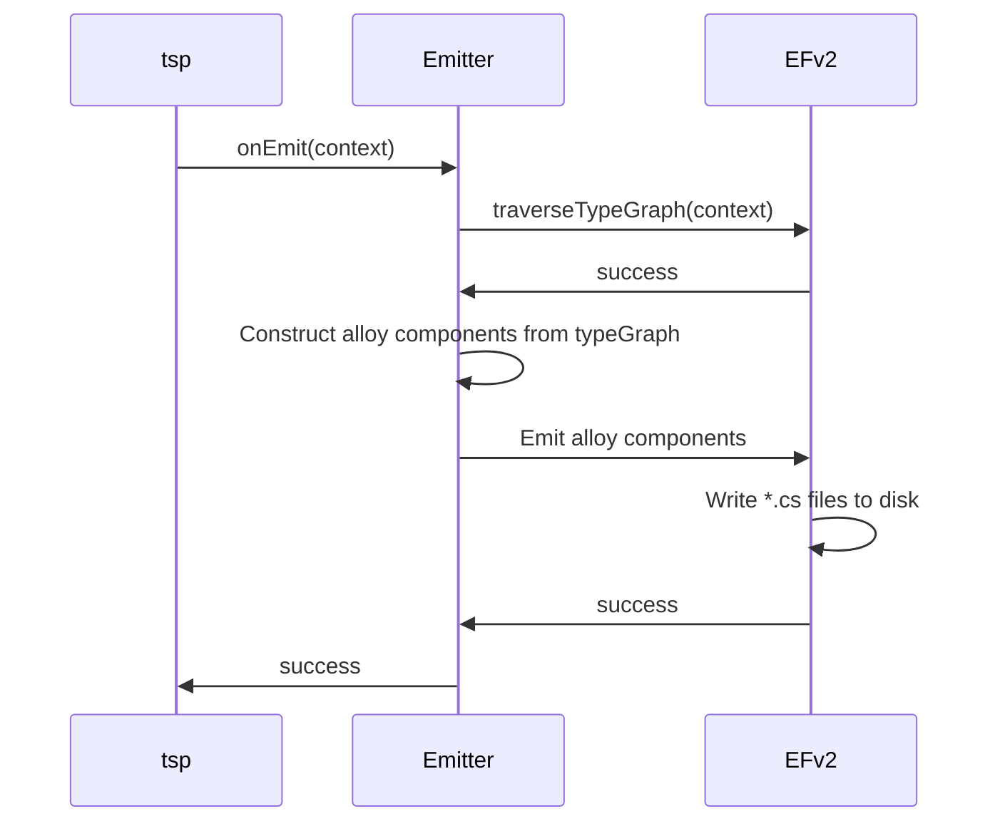
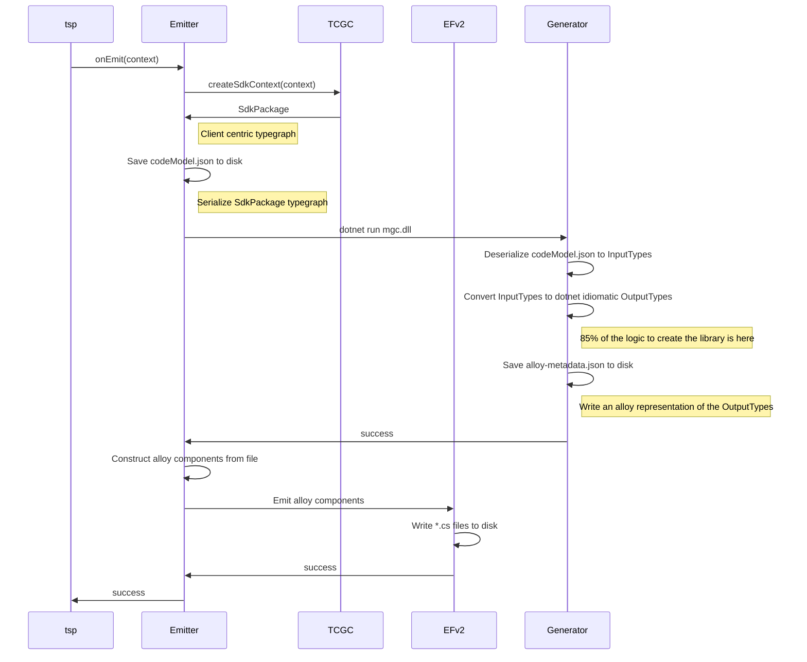
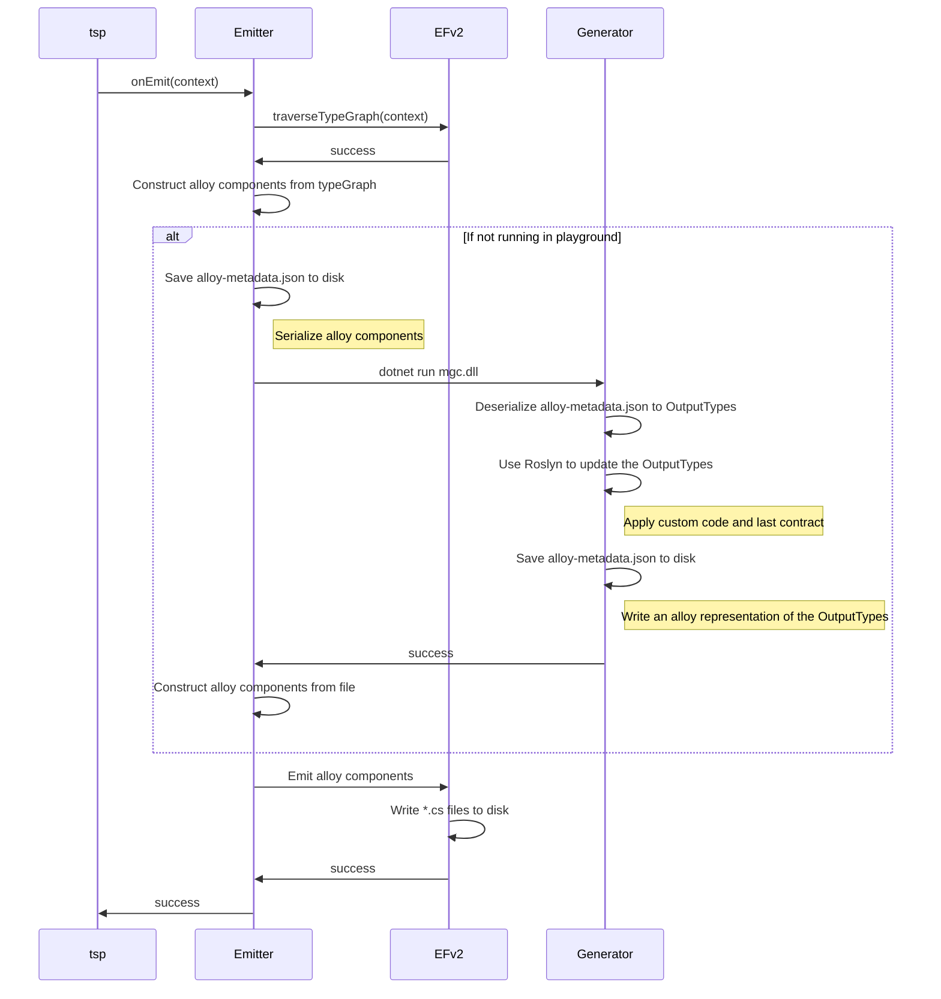

# Summary

When generating clients there are three `views` that need to be taken into account in order to generate a more accurate client.
- `Spec View`: This matches exactly what the spec says to create including any customizations in client.tsp.
- `Custom Code View`: This is completely custom code that library authors will write to augment what would be generated by the spec alone.  Typically these are customizations that can't be done in client.tsp like method body implementations or language specific property type changes.
- `Last GA Contract View`:  This matches exactly what the last GA version of the library looked like.  It does not match the last version of the spec because there could have been custom code involved as well as some versions of the spec do get skipped on occasion.

All three of these views get combined using various logic to create the final product that is backwards compatible and follows the standards for a given language.

# Scenarios

## Spec Only

This scenario will show a very simple spec only generation.

<details>
  <summary>Example</summary>
  
  Lets start with a simple typespec with 1 model and one operation
  
  ```tsp
  namespace Store;
  
  model Foo {
    x: int;
  }
  
  op method(...Foo) : Foo;
  ```
  
  This will generate the following client code
  
  ```c#
  public partial class Foo
  {
    public int X { get; set; }
  }
  
  public partial class StoreClient
  {
    public ClientResult<Foo> Method(int x, CancellationToken token = default)
    {
      Foo foo = new Foo()
      {
        X = x
      }
      //send foo to the service
    }
  }
  ```
</details>
  
## Spec with custom overload
  
This example shows how the custom code can change what gets generated when adding an overload which takes the model instead of the spread.
  
<details>
  <summary>Example</summary>
  
  Lets start with a simple typespec with 1 model and one operation
  
  ```tsp
  namespace Store;
  
  model Foo {
    x: int;
  }
  
  op method(...Foo) : Foo;
  ```
  
  Lets also define the custom code which adds the overload
  
  ```c#
  public partial class StoreClient
  {
    //no need to define the body of the method since the generation can take care of this part.
    public ClientResult<Foo> Method(Foo foo, CancellationToken token = default) => throw null;
  }
  ```
  
  Using the custom code the generator will make some different choices on the implementation of what was in the spec.
  
  ```c#
  public partial class Foo
  {
    public int X { get; set; }
  }
  
  public partial class StoreClient
  {
    public ClientResult<Foo> Method(int x, CancellationToken token = default)
    {
      Foo foo = new Foo()
      {
        X = x
      }
      return Method(foo, token);
    }
  
    public ClientResult<Foo> Method(Foo foo, CancellationToken token = default)
    {
      //send foo to the service
    }
  }
  ```
</details>
  
## Spec with backwards compatibility issue in second version
  
In this scenario we first generate a client from a spec and GA that client.  Later the spec will change and we will need to generate a new client.
We will need to inspect the last GA contract in order to determine what to generate so that we create a backwards compatible result.

<details>
  <summary>Example</summary>
  
  We first start with a very simple spec for v1.
  
  ```tsp
  namespace Store;
  
  model Foo {
    x: int;
  }
  
  op method(...Foo) : Foo;
  ```
  
  This will generate the following client code
  
  ```c#
  public partial class Foo
  {
    public int X { get; set; }
  }
  
  public partial class StoreClient
  {
    public ClientResult<Foo> Method(int x, CancellationToken token = default)
    {
      Foo foo = new Foo()
      {
        X = x
      }
      //send foo to the service
    }
  }
  ```
  
  Next we introduce a new optional property to the Foo model in v2.
  
  ```tsp
  namespace Store;
  
  model Foo {
    x: int;
    y?: int;
  }
  
  op method(...Foo) : Foo;
  ```
  
  If we just use the spec this will result in a backwards compatibility issue since we will introduce a new optional parameter that isn't at the end of the method.
  
  ```c#
  public ClientResult<Foo> Method(int x, int? y = null, CancellationToken token = default)
  ```
  
  Using the last contract view we can detect this and automatically generate a client that would be backwards compatible and that would look like this.
  
  ```c#
  public partial class Foo
  {
    public int X { get; set; }
  }
  
  public partial class StoreClient
  {
    public ClientResult<Foo> Method(int x, CancellationToken token)
    {
      return Method(x, null, token);
    }
  
    public ClientResult<Foo> Method(int x, int? y = null, CancellationToken token = default)
    {
      Foo foo = new Foo()
      {
        X = x,
        Y = y
      }
      //send foo to the service
    }
  }
  ```
</details>

# Solution to explore

There are a few gaps we have when considering the goals [here](https://loop.cloud.microsoft/p/eyJ1IjoiaHR0cHM6Ly9taWNyb3NvZnQuc2hhcmVwb2ludC5jb20vc2l0ZXMvNGI4Y2Q1NmItNmQ0MC00YWIzLWJlYTUtMTc0NGQ0ZDczY2RmP25hdj1jejBsTWtaemFYUmxjeVV5UmpSaU9HTmtOVFppTFRaa05EQXROR0ZpTXkxaVpXRTFMVEUzTkRSa05HUTNNMk5rWmlaa1BXSWxNakZ2Y1dWcE5VTmtVMm93VTBKb01VSnVMVkZRVGpKeFN6QllWbkJQYVdGR1VHaHpaMUJVYUVkU1RuUnZORE5qTTFKTE1VMDVVWEEwVDFaeFpsVjNiMlZwSm1ZOU1ERlZVVmRGV1ZCTlFVSlRTRmRRVFVKRFJGSkZNbE5TTTBGWVFWY3lRVFpDVlNaalBTVXlSaVpoUFV4dmIzQkJjSEFtY0QwbE5EQm1iSFZwWkhnbE1rWnNiMjl3TFhCaFoyVXRZMjl1ZEdGcGJtVnlKbmc5SlRkQ0pUSXlkeVV5TWlVelFTVXlNbFF3VWxSVlNIaDBZVmRPZVdJelRuWmFibEYxWXpKb2FHTnRWbmRpTW14MVpFTTFhbUl5TVRoWmFVWjJZMWRXY0U1VlRtdFZNbTkzVlRCS2IwMVZTblZNVmtaUlZHcEtlRk42UWxsV2JrSlFZVmRHUjFWSGFIcGFNVUpWWVVWa1UxUnVVblpPUkU1cVRURktURTFWTURWVldFRXdWREZhZUZwc1ZqTmlNbFp3WmtSQmVGWldSbGhTVm14UlZGVmFTVlF4WkVST1JYaFlWbXh2TVZGVmJFWldlbVJOVXpCMFQxSkZPVTlVZWtrbE0wUWxNaklsTWtNbE1qSnBKVEl5SlROQkpUSXlZV1UxWVRCbU9UTXRPRGhtTlMwMFpXVmhMV0ZpTkRrdE16bGtPV1ZrTkdRNE5UQmpKVEl5SlRkRSJ9?ct=1728577817115&&LOF=1).

1. <a name="gap1"></a>The first is that a customer who learns how to extend or compose their customizations in one language would not be able to directly apply those learnings to doing the same task in another language.  Ensuring that all emitters produce alloy components and utilize EFv2 to emit those into code files will allow us to provide this consistency across languages.
2. <a name="gap2"></a>Another gap is that we aren't creating or using EFv2 components that can be reused by the community to build 3p emitters.  This means the barrier to entry for starting your own dotnet emitter using EFv2 would be very high.  If we had a baseline set of components that could work with dotnet it would make it much easier for the community to use and contribute to.
3. <a name="gap3"></a>Another gap is around currently we rely on out of proc calls to dotnet components in order to complete the generation.  This introduces challenges when we want to run the emitter fully in the web.  If the emitters were written completely in javascript this wouldn't be an issue.

The main challenge for mitigating these gaps for non javascript languages is we rely heavily on language specific tools and re-writing those tools in javascript would introduce a significant implementation and maintenance cost.

## North Star

Lets first start with what would things look like if we eliminated all the gaps and what would be required to get there.

### Design



### Proposed alloy components

The design of the alloy components has two main considerations.

1. **Balance in granularity:** We need the components to be granular enough such that the extension points for customers are reasonable.  If we have a component which is an entire class a customer who wanted to customize the xml docs for a method would need to write a parser to find the method in the string, find the xml docs above the method and then insert their comments inline.  If instead we have a method sub component in the class and a doc comments component for the method they could directly find the doc comment component and modify its contents.  At the same time we don't want to go all the way down to an assignment component or for loop component.
2. **Cross language consistency:** We need some degree of consistency across languages in order to realize the goal of learning how to customize in one language does not require relearning if you want to do the same thing in another language.  If one language had a method component with no sub components and another language had a method signature subcomponent and a method body subcomponent this would miss the mark on the stated goal.

The following is a proposed breakdown of what the components would look like for csharp.  This isn't exhaustive but a representation of the direction.

```xml

<Directory name: string>
    <Directory ... />
    <Type name: string, isStruct: bool, fileName: string>
        <Docs>
            <Summary content: string/>
            <Parameter paramName: string, content: string/>
            <Remarks content: string/>
            <Returns content: string/>
            <Throws exceptionType: string, content: string/>
        </Docs>
        <Attribute type: string>
        <Initializer param: string, value: string>
        </Attribute>
        <InterfaceImplementation type: string/>
        <WhereClause clause: string/>
        <Field name: string, type: string/>
        <Constructor>
            <Docs>
                <Summary content: string/>
                <Parameter paramName: string, content: string/>
                <Remarks content: string/>
                <Returns content: string/>
                <Throws exceptionType: string, content: string/>
            </Docs>
            <Attribute type: string>
                <Initializer param: string, value: string>
            </Attribute>
            <CtorSignature>
                <Parameter name: string, type: string/>
                <WhereClause clause: string/>
                <BaseInitializer param: string, value: string/>
            </CtorSignature>
            <Body content: string/>
            <Expression content: string/>
        </Constructor>
        <AutoProperty name: string, type: string, hasSet: bool, hasInit: bool>
            <Docs>
                <Summary content: string/>
                <Parameter paramName: string, content: string/>
                <Remarks content: string/>
                <Returns content: string/>
                <Throws exceptionType: string, content: string/>
            </Docs>
            <Attribute type: string>
                <Initializer param: string, value: string>
            </Attribute>
        </AutoProperty>
        <Property name: string, type: string>
            <Docs>
                <Summary content: string/>
                <Parameter paramName: string, content: string/>
                <Remarks content: string/>
                <Returns content: string/>
                <Throws exceptionType: string, content: string/>
            </Docs>
            <Attribute type: string>
                <Initializer param: string, value: string>
            </Attribute>
            <Get>
                <Body content: string/>
                <Expression content: string/>
            </Get>
            <Set>
                <Body content: string/>
                <Expression content: string/>
            </Set>
        </Property>
        <Method name: string>
            <Docs>
                <Summary content: string/>
                <Parameter paramName: string, content: string/>
                <Remarks content: string/>
                <Returns content: string/>
                <Throws exceptionType: string, content: string/>
            </Docs>
            <Attribute type: string>
                <Initializer param: string, value: string>
            </Attribute>
            <MethodSignature returnType: string>
                <Parameter name: string, type: string/>
                <WhereClause clause: string/>
            </Signature>
            <Body content: string/>
            <Expression content: string/>
        </Method>
        <Class ... />
        <Enum ... />
    </Class>
    <Enum underlyingType: string, isExtensible: bool>
        <Docs>
            <Summary content: string/>
            <Parameter paramName: string, content: string/>
            <Remarks content: string/>
            <Returns content: string/>
            <Throws exceptionType: string, content: string/>
        </Docs>
        <EnumMember name: string, value: string/>
    </Enum>
</Directory>

```

### Work todo

1. <a name="work1"></a>Convert TCGC createSdkContext into TypeKit helpers
2. <a name="work2"></a>Rewrite logic of converting InputTypes into OutputTypes in javascript
3. <a name="work3"></a>Replace roslyn capability to compare and merge custom code
4. <a name="work4"></a>Replace roslyn capability to compare and update code based on last GA contract
5. <a name="work5"></a>Replace capability to reflect over runtime dependencies of emitted libraries during generation and use the rich type information to inform the generation.
6. <a name="work6"></a>Create dotnet alloy components
7. <a name="work7"></a>Create the logic to write the alloy components into formatted code files using EFv2

If we can split this work into a few different phases we can achieve many of the goals up front for a lot less work.

## Phase 1

T-shirt Estimate XL

In this phase we modify the existing out of proc generator to instead of emitting code files to disk write an alloy component representation to disk.  This could then be loaded back in by the emitter, used to construct all the alloy components in memory, and finally send that to EFv2 to write out the *.cs files.  Anyone composing or extending would be able to do so as if there was no out of proc step.  This phase would eliminate Gap [1](#gap1) and [2](#gap2) while only requiring us to do Work [6](#work6) and [7](#work7).



This solution allows us to still depend on the language specific tooling while still accomplishing the goals of having a consistent story for all languages.  The format of the alloy-components.json file would look something like this.

```json

{
  "directories": [ {
      "name": "src",
      "types": [ {
          "fileName": "Model.cs",
          "kind": "model",
          "name": "Model",
          "autoProperties": [ {
              "name": "X",
              "type": "string",
              "hasSet": true
            }
          ],
        },
        {
          "name": "Client.cs",
          "kind": "client",
          "name": "Client",
            "methods": [ {
              "name": "DoSomething",
              "signature": {
                  "returnType": "ClientResult<Foo>",
                  "parameters": [ {
                    "name": "x",
                    "type": "int"
                  }
                ],
              },
              "body": "var request = CreateRequest(x);\nreturn request.Send();"
            }
          ]
        }
      ]
    }
  ]
}

```

Each component would be represented by an object in the json structure which would make this easy to convert back into actual alloy components in the emitter like this.

```js

const alloyComponents = getComponentsFromJson();

const directories = alloyComponents.directories.map(d =>
  const types = d.types.map(t => <cs.Type type={t} />);
  const enums = d.enums.map(e => <cs.Enum enum={e} />);
  return <cs.Directory directory={d}>
    {types}
    {enums}
  </cs.Directory>
);

return (
  <ay.Output namePolicy={csNamePolicy}>
    {directories}
  </ay.Output>
);

```

## Phase 2

T-shirt Estimate XXXL

In this phase the main goal would be to tackle Gap [3](#gap3).  This would require us to finish Work [2](#work2) and [5](#work5).  Once we have that work done we can run in the playground only using the javascript portion of the emitter.  Since using custom code in a playground scenario is not a big use case nor would it be common to want to pull in the latest contract as a backwards compatibility check we can safely skip these steps in that mode.  When running on a development machine however we would utilize these steps still depending on an out of proc step using Roslyn.



## Phase 3

T-shirt Estimate XXXXL

If we make it this far and still find reasons to get to the north star we can start to look at how to replace Roslyn with alternative approaches.